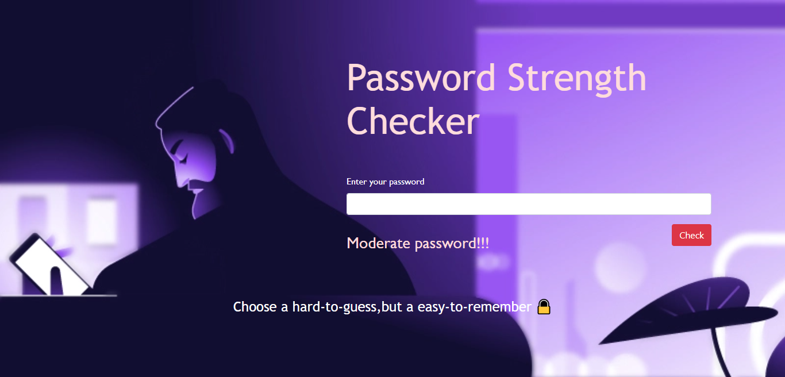

# Password-Strength-Checker

 

  
This is a simple flask app which tells you the strength of any password entered as strong, weak or moderate. 
  
  The vectorizer used in this project is **TfidfVectorizer** from the **sklearn.feature_extraction.text** library and the model created is **Multinomial Logistic Regression model**.
 
## Screenshots:

<h3>Homepage</h3>

<h3>Adding Password</h3>

 
<h3>Strong Password</h3>

 
<h3>Moderate Password</h3>

<h3>Weak Password</h3>

 
 

